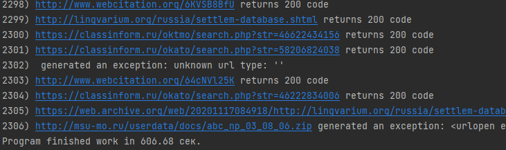
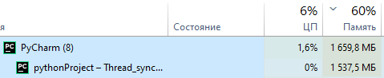
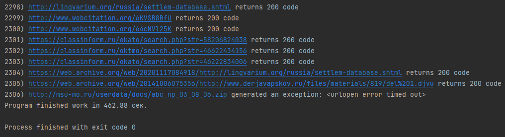
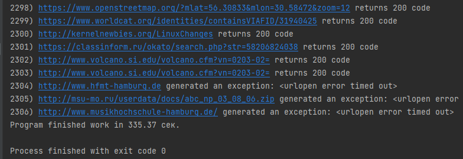
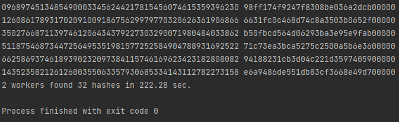
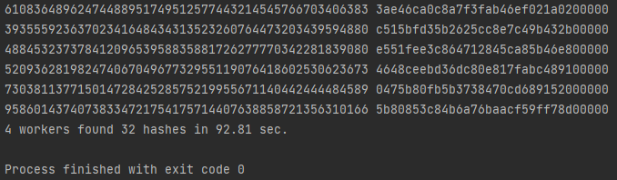
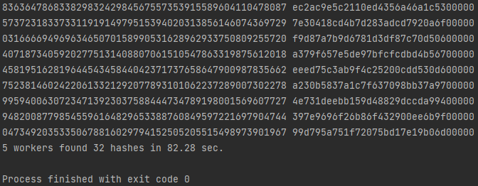
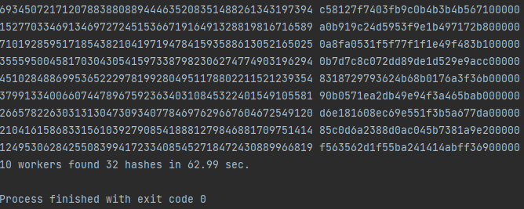
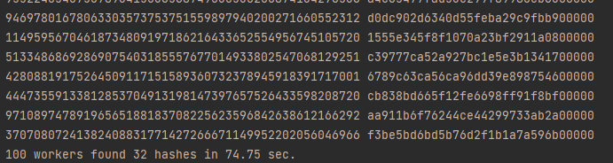

# Parallelism and Asynchrony
## IO-bound. Проверяем ссылки на страницах Википедии
1. Время синхронной проверки ссылок

2. 5 воркеров
 
3. 10 воркеров

4. 100 воркеров

5. Количество воркеров влияет на критично загрузку памяти, ЦП держится на одном уровне (11% на 100 воркерах -скачок), 
время работы уменьшается при большем количестве воркеров.

## CPU-bound. Генерируем монетки
1. 2 Воркера, 22% ЦП 
2. 4 Воркера, 45% ЦП 
3. 5 Воркеров, 55% ЦП 
4. 10 Воркеров, 98% ЦП 
5. 100 Воркеров, 99% ЦП 

При большем количестве воркеров нагрузка на ЦП повышалась, но система не давала 100% загрузку ЦП.

На скриншотах видно, что при 100 воркерах программа завершилась позже, чем при 10. Всё за количества процессов, их очень много
и ЦП тратит время на передачу задач исполнения от одного процесса к другому.